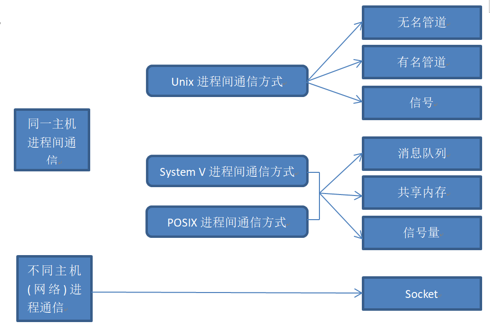

### 一：进程
#### 进程号(PID)
每个进程都由一个进程号来标识，其类型为pid_t，进程号的范围为0-32767
进程号总是唯一的，但进程号可以重用。
Linux系统的进程号由0开始。进程号为0及1的进程由内核创建
进程号为0的进程通常是调度进程，常被称为交换进程。进程号为1的进程通常是init进程

**进程号（PID）**
**父进程号（PPID）**
**进程组号（PGID）**
进程组是一个或多个进程的集合。他们相互关联，进程组可以接受同一终端的各种信号

包含的头文件：
 `#include<sys/type.h>`
 `#include<unistd.h>`
`pid_t getpid(void)  pid_t getppid(void) pid_t getpgid(pid_t pid)`

#### 进程的创建
 `#include<sys/type.h>`
 `#include<unistd.h>`

`pid_t fork(void)`: 从一个已存在的进程中创建一个新进程，新进程为子进程, 原进程为父进程
**返回值**：
成功：子进程中返回0， 父进程中返回子进程的PID
失败：返回-1
使用fork函数得到的子进程是父进程的一个复制品，**它从父进程继承了整个进程的地址空间**比如局部、全局变量、缓冲区等，使用fork函数的代价是很大的
子进程从fork（）开始执行

`pid_t vfork(void)`
功能：
在已有的进程中创建子进程
vfork()保证子进程先运行，在它调用exec或exit之后，父进程才可能调度运行
vfork()但它并不将父进程的地址空间完全复制到子进程中，因为调用exec或exit,于是也就不访问该地址空间,**在子进程调用exec或exit之前，它在父进程的地址空间中运行。**会共用地址空间
返回值：
创建子进程成功，则在子进程中返回0，父进程返回子进程的ID，出错返回-1
note:
不能用return 返回

标准IO提供了三种类型的缓冲：
全缓冲（大小不定）：在填满标准IO缓冲区后，才进行实际的IO操作。
行缓冲（大小不定）：在遇到换行符时，标准IO库执行IO操作。允许我们一次输入一个字符，但只有写了一行后才进行实际的IO缓冲。
不带缓冲

#### 进程的挂起
进程在一定时间内没有动作称为进程的挂起
 `#include<unistd.h>`
`unsight int sleep(unsigned int sec)`
function:
进程挂起指定秒数，直到指定的时间用完或收到信号才解除挂起
return:
若挂起到指定秒数则返回0，若有信号中断则返回剩余秒数
注意：
到时后并不会立即执行，系统只是将该进程切换到就绪态

#### 进程的等待
父子进程有时需要简单的进程间同步，如父进程等待子进程结束
 `#incldue<sys/types.h>`
 `#include<sys/wait.h>`
函数：wait()、waitpid()

`pid_t wait(int *status)`
功能：
等待子进程的终止，如果子进程终止了，此函数会会回收子进程的资源。
调用wait()函数的进程会挂起，直到它的一个子进程退出或收到一个不能被忽视的信号时才被唤醒
参数：
函数返回时，参数status中包含子进程退出时的状态信息。子进程的退出信息在一个int中包含了多个字段，用宏可以取出其中的每个字段

`pid_t waitpid(pid_t pid, int *status, int options)`
功能：等待子进程终止，如果子进程终止了，此函数会回收子进程的资源
参数pid的类型：
pid > 0
pid = 0
pid = -1
pid < -1
参数option:
0:

**特殊进程：**
僵尸进程：
孤儿进程：
守护进程：特殊的孤儿进程

#### 进程的终止exit
continue
break
return
exit     在进程的子函数中调用，进程被杀死

linux下通过以下函数结束进程
 #include<stdio.h>
 void exit(int value)  ->库函数
 参数：返回给父进程的参数

 #include<unistd.h>
void _exit(int value)  ->系统调用

#### 注册进程退出清理
 #include<stdlib.h>
 int atexit(void (*function)(void))
 功能：注册进程正常结束前调用的函数，进程退出执行注册函数
 正常结束前调用函数的顺序和注册时的顺序相反

#### 进程的替换
exec函数族，是由六个exec函数组成(execute a file)
 1.exec函数族提供了六种在进程中启动另一个程序的方法
 2.exec函数族可以根据指定的文件名或目录名找到可执行文件
 3.调用exec函数的进程并不创建新的进程，故调用前后，进程的进程号并不会改变，全由新程序替换，而新程序则从main函数开始执行
 **exec函数族取代调用进程的数据段、代码段、堆栈段**

**exec函数族**
 #include<unistd.h>
int execl(const char *pathname,const char *arg()   , NULL)
int execlp(const char *file, const char *arg,   , NULL)
int execle(const char *path, const char *arg,    , char * const envp[])
int execv(const char *path, char *const argv[])
int execvp()
int execvpe()

一个进程调用exec后，除了进程ID，进程还保留以下特征不变：
父进程号
进程组号
控制终端
根目录
当前工作目录
进程信号屏蔽集
未处理信号

int system(const char *command)

### 二: 进程间通信
进程间通信(IPC：inter processes communication)
进程是一个独立的资源分配单元，不同进程(用户进程)之间的资源是独立的，不能在一个进程访问另一个进程的资源
进程不是孤立的，不同进程需要进行信息的交互和状态的传递等，因此需要进程间的通信

#### 进程间通信功能
**数据传输**:一个进程需要将它的进程发送给另一个进程
**资源共享**:多个进程之间共享同样的资源
**通知事件**：一个进程需要向另一个进程发送消息，通知它们发生了某种事件
**进程控制**：有些进程希望完全控制另一个进程的执行

POSIX进程间通信
Socket进程间通信
#### linux支持的主要进程通信的通信机制

#### 三：信号
信号是软件中断，它是在软件层次上对中断机制的一种模拟
信号可以导致一个正在运行的进程被另一个正在运行的异步进程中断，转而处理某一个突发事件
**信号是一种异步通信方式**
信号可以直接进行用户空间进程和内核空间进程的交互，内核空间可以利用它来通知用户进程发生了哪些系统事件

每个信号的名字都以字符SIG开头。
每个信号和一个数字编码相对应，在头文件signum.h中
kill -l 查看信号和数字编码

以下条件产生一个信号：
1.用户按某些终端时产生信号：
Ctrl+c 产生中断信号SIGINT   Ctrl+\产生中断信号SIGQUIT ctrl + Z
2.硬件异常 
3.软件异常
4.调用kill函数将发送信号

**一个进程收到一个信号的时候，可以用如下方法进行处理**
1.执行系统的默认动作
2.忽略此信号
3.执行自定义信号处理函数 ：**函数可以采用signal函数改变信号的处理方式**
注意：SIGKILL 和 SIGSTOP 不能更改信号的处理方式，因为他们提供了一种使进程终止的可靠方法

 #include<signal.h>
sighandler_t signal(int signum, sighandler_t handler)
功能：
注册信号处理函数
参数：
handler的取值：
    忽略该信号：SIG_IGN
    执行系统默认动作：SIG_DFL
    自定义信号处理函数：信号处理函数名

signal函数的返回值：

#### 信号的基本操作
kill函数：
 #include<signal.h>
 int kill(pid_t pid, int signum)
功能：
给指定进程发信号

**pid取值有四种情况：**
pid > 0:给进程ID为pid的进程发信号
pid = 0：当前进程所在的进程组中的所有进程
pid = -1：系统内的所有进程
pid < -1 : 将信号传送给指定进程组的所有进程，进程组号为pid的绝对值

alarm函数：
 #include<unistd.h>
unsigned int alarm(unsigned int seconds)

raise函数：
 #include<signal.h>
int raise(int signum);
功能：给调用进程本身送一个信号(立刻干掉)

abort()函数
 #include<stdlib.h>
 void abort(void)
 功能：向进程发送一个SIGABRT信号，默认情况下进程会退出

pause函数：

#### 可重入函数
可重入函数是指函数可以由多个任务并发执行，而不必担心数据错误
编写可重入的函数：
   1.不使用静态的数据、全局变量（除非用信号量互斥）
   2.不调用动态内存分配、释放的函数
   3.不调用任何不可重入的函数（如：标准IO）
注意：
即使信号处理函数使用的都是可重入函数，也要注意进入处理函数时，首先保存errno的值

#### 信号集
#### 信号集概述
为了方便对多个信号进行处理，在Linux系统引入了信号集，信号集是用来表示多个信号的数据类型

#### 信号集数据类型
 sigset_t
    
    # define _SIGSET_NWORDS (1024 / (8 * sizeof (unsigned long int)))
    typedef struct
    {
      unsigned long int __val[_SIGSET_NWORDS];
    } __sigset_t;

#### 信号集相关操作函数
 #include<signal.h>
`sigemptyset()
sigfillset()
sigismember()
sigaddset()
sigdelset()`

#### 信号阻塞集（屏蔽集）
每个进程都有一个阻塞集，它用来描述哪些信号递送到该进程的时候被阻塞（在信号发生时记住它，直到进程准备好时再将信号通知进程）
是暂缓信号的传递

sigprocmask函数
创建一个阻塞集合
 #include<signal.h>
int sigprocmask(int how, const sigset_t *set, sigset_t *oldset);

### 四：管道、命名管道
#### 管道概述
管道（pipe）又称无名管道
无名管道是一种特殊类型的文件，在应用层体现为**两个**打开的文件描述符

**管道是最古老的UNIX IPC方式**，其特点是：
1.半双工，数据在一个时刻只能在一个方向上流动
2.*数据只能从管道的一端写入，从另一端读出*
3.写入管道的数据遵循先入先出的规则
4.管道所传输的数据是无格式的，这要求管道的读出方式与写入必须事先约定好数据的格式
5.*管道不是普通的文件，不属于文件系统，只存在在内存中*
6.管道在内存中对应一个缓冲区，不同的系统其大小不一定相同
7.从管道读取数据是一次性操作，数据一旦被读走，就从管道抛弃，释放空间以便写更多数据
8.管道没有名字，只能在公共祖先的进程之间继承。

#### 无名管道的创建
pipe函数
 #include<unistd.h>
int pipe(int filedes[2])
功能：经由参数filedes返回两个文件描述符
参数：
filedes为int型数组的首地址，其内存放了管道的文件描述符fd[0]\fd[1]
filedes[0]为读而打开，filedes[1]为写而打开。
注意：
利用无名管道进行进程间的通信，都是父进程创建无名管道，然后再创建子进程，子进程继承父进程的无名管道的文件描述符，然后父子进程通过读写无名管道实现通信。
**从管道中读数据的特点**
 1.默认read函数从管道中读数据是阻塞de
 2.调用write函数向管道里写数据，当缓冲区已满时write被阻塞
 3.通信过程中，读端口全部关闭后，写进程向管道内写数据时，写进程会（收到SIGPIPE信号）退出

**编程时可通过fcntl函数设置文件的阻塞特性**
设置为阻塞：
  fcntl(fd, F_SETFL, 0);
设置为非阻塞：
  fcntl(fd, F_SETFL, O_NONBLOCK)

### 文件描述符概述
**文件描述符是非负整数，是文件的标识**
用户使用文件描述符来访问文件。
利用open打开一个文件时，内核会返回一个文件描述符
每个进程都有一个文件描述符表，**进程被创建时，标准输入，标准输出，标准错误输出设备文件被打开，对应的文件描述符0，1，2 记录在表中**

#### 文件描述符的复制
dup和dup2是两个非常有用的系统调用，都是用来复制一个文件描述符，使新的文件描述符也标识旧的文件描述符所标识的文件
int dup(int oldfd)
int dup2(int oldfd, int newfd)
dup 和 dup2经常用来**重定向进程**的stdin stdout stderr

**dup函数**(duplicate)
 #include<unistd.h>
 int dup(int oldfd)
 功能：
 复制oldfd文件描述符，并分配一个新的文件描述符，**新的文件描述符是调用进程文件描述符表的最小可用的文件描述符**
 **dup2函数**
 int dup2(int oldfd, int newfd)
 功能：
 复制，并且分配新的文件描述符newfd, newfd也标识oldfd所标识的文件
 注意：
 newfd是小于文件描述符最大允许值的非负整数，如果newfd是一个已经打开的文件描述符，则首先关闭该文件，然后再复制
dup3()函数：
 

**复制文件描述符后新旧文件的特点**
使用dup或dup2复制文件描述符后，新文件描述符和旧文件描述符指向同一个文件，共享文件锁定、读写位置、和各项权限
当旧文件描述符关闭时，通过新文件描述符仍可以操作文件
当新文件描述符关闭时，仍可通过旧文件描述符操作文件

 **exec前后文件描述符的特点** exec后进程的文件描述符表是否还用？
close_on_exec标志决定了文件描述符再执行exec后文件描述符是否可用
文件描述符的close_on_exec标志默认是关闭的，即文件描述符在执行exec后文件描述符**是可用的**
若没有设置close_on_exec标志位。进程中打开的文件描述符，及其相关的设置在exec后不变，可供新启动的程序使用

**设置close_on_exec标志位的方法**
`flag = fcntl(fd, F_GETFD)`
`flag |= FD_CLOEXEC`
`flag &= FD_CLOEXEC`
`fcntl(fd, F_SETFD, flags)`

int fcntl(int fd, int cmd, . . . /  arg /);

### 命名管道(FIFO)
命名管道(FIFO)和管道(pipe)基本相同，但有一些显著的不同，其特点是：
1.半双工，数据在一时间只能在一个方向上滚动
2.写入FIFO中的数据遵循先入先出的规则
3.FIFO所传送的数据是无格式的，这要求FIFO的读出方必须事先约定好数据格式，如多少字节算一个消息
4.FIFO在文件系统作为一个特殊的文件而存在, 但FIFO中的内容却存放在内存当中
5.管道在内存当中对应一个缓冲区，不同的系统其大小不一定相同
6.从FIFO中读数据是一次性操作，数据一旦被读，就会从FIFO中被抛弃
7.当使用FIFO的进程退出后，FIFO文件将继续保存在文件系统中以便以后使用
8.FIFO有名字， 不相关的进程可以通过打开命名管道进行通信

mkfifo函数：
 #include<sys/types.h>
 #include<sys/stat.h>
int mkfifo(const char *pathname, mode_t mode);
mkfifo用mode(以八进制)指定的权限位创建一个名为pathname的FIFO。通常，mode的值会被进程的umask修改。
注意：要实现判断一个文件或目录在被umask修改后权限模式是什么，
方法 mode & ~umask

**操作FIFO文件时的特点**
系统调用的IO函数都可以用于FIFO，如open close read write
打开FIFO时，非阻塞标志（O_O_NONBLOCK）产生下列影响：
特点一：
不指定O_NONBLOCK
1.open以只读方式打开FIFO时，要阻塞到某的进程为写而打开此FIFO
2.open以只写方式打开FIFO时，要阻塞到某个进程为读而打开此FIFO
3.open以只读、只写的方式打开FIFO时会阻塞，调用read函数从FIFO里读数据时read会阻塞
4.通信过程中，读进程退出后，写进程向命名管道内写数据时，写进程也会（收到SIGPIPE信号）退出
5.调用write函数向FIFO里写数据，当缓冲区已满时write也会阻塞

特点二：
指定O_NONBLOCK
1.先以只读方式打开：如果没有进程已经为写而打开一个FIFO，只读open成功，并且open不阻塞
2.先以只写方式打开，如果没有进程已经为读而打开一个FIFO，只写open将出错返回-1
3.read\write读写命名管道中读数据不阻塞
4.通信过程中，读进程退出后，写进程向命名管道内写数据时，写进程也会（收到S退出

### 消息队列
消息队列是消息的链表，存放在内存当中，由内核维护
#### 消息队列概述
**消息队列的特点**
1.消息队列的消息是有类型的
2.消息队列的消息是有格式的
3.消息队列可以实现消息的随机查询。消息不一定要以先进先出的次序读取，编程时可以按消息的类型读取
4.消息队列允许一个或多个进程向它写入或者读取消息
5.与无名、有名管道类似，从消息队列中读出消息，消息队列中对应的数据都会被删除
6.每个消息队列都有消息队列标识符，消息队列的标识在整个系统中是唯一的
7.只有内核重启或者人工删除消息队列，该消息队列才会被删除，若不人工删除消息队列，消息队列会一直存在在系统中
**消息队列限制值**
每个消息的内容最多为8k字节
系统中消息队列的个数最多为1609个

System V提供的IPC通信机制需要一个key值，通过key值就可以在系统内获得一个唯一的消息队列标识符，可以通过ftok()获得
**ftok()**
 #include<sys/types.h>
 #include<sys/ipc.h>
key_t ftok(const char *pathname, int proj_id)
功能：获得项目相关的唯一的IPC键值
参数：pathname 路径名
     proj_id 项目ID（只有低八位有效）
返回值：成功返回key值   失败返回-1

**消息队列的创建**
 #include<sys/msg.h>
int msgget(key_t key, int msgflg)
功能：

### 共享内存
#### 共享内存概述
共享内存允许两个或者多个进程共享给定的存储区域
**共享内存的特点**
1.共享内存是进程间共享数据的一种最快的方法
一个进程向共享内存写数据，共享这个内存的所有进程就可以立即看到其中的内容
2.使用共享内存要注意：多个进程对一个给定存储区域访问的互斥
**共享内存的限制**
1.共享内存最小一个字节
2.共享存储区最大32M字节
#### 获得一个共享存储标识符
 #include<sys/ipc.h>
 #include<sys/shm.h>
int shmget(key_t key, size_t size, int shmflg)
功能：创建或打开一块共享内存
参数：
key:IPC键值
shmflg:标识函数的行为及共享内存的权限
IPC_CREAT：如果不存在就创建
#### 共享内存映射(attach)
将物理地址映射到逻辑地址
 #include<sys/type.h>
 #include<sys/shm.h>
void *shmat(int shmid, const void *shmaddr, int shmflg)
功能：将一个共享内存段映射到调用进程的数据段中
参数：
shmid:共享内存标识符
shmaddr:共享内存的映射地址（NULL则系统自动指定）
shmflg:共享内存段的访问权限和映射条件
0：共享内存具有可读可写权限

解除共享内存映射（detach）
 #include<sys.type.h>
 #include<sys/shm.h>
 int shmdt(const void *shmaddr);
 功能：将共享内存和当前进程分离（仅断开联系并不删除共享内存）
参数：shmaddr：共享内存映射地址

共享内存控制
 #include<sys.type.h>
 #include<sys/shm.h>
 int shmctl(int shmid, int cmd, struct shmid ds *buf)
 功能：共享内存空间的控制

## 多线程编程
一个进程可以拥有M个内核线程和N个用户线程，其中M<=N
线程的实现方式分为三种模式：完全在用户空间实现，完全由内核调度，双层调度
现代Linux使用的线程库是NPTL，都是采用1：1实现的

### 线程
线程一般不拥有资源（除了必不可少的程序计数器、一组寄存器和栈），但它可以访问所属进程的资源，如进程代码，数据段以及系统资源
系统开销：线程的切换只需要保存和设置少量寄存器的内容，并不涉及存储器管理方面的操作
并发性：不仅进程间可以并发执行，而且在一个进程中的多个线程也可以并发执行
##### 线程的基本操作
每个线程都有一个线程号。
进程号在整个系统中是唯一的，但线程号不同，线程号只在它所属的进程环境有效
线程号用pthread_t数据类型表示
int pthread_create(pthread_t *thread, const pthread_attr_t *attr,
                          void *(*start_routine) (void *), void *arg);
typedef unsigned long int pthread_t

参数：thread：线程标识符的地址
     sttr：线程属性结构体地址
     start_routine:线程函数的入口地址
     arg:传给线程函数的参数

线程属性：
线程属性设置有一系列的函数进行调用
线程属性初始化：
应先初始化线程属性，然后再pthread_create创建线程
int pthread_attr_init(pthread_attr_t *attr);
int pthread_attr_destroy(pthread_attr_t *attr);
线程分离状态：
线程的分离状态决定以一种什么样的方式结束自己
非分离状态(默认状态)  和  分离状态
 #include <pthread.h>
int pthread_attr_setdetachstate(pthread_attr_t *attr, int detachstate);
int pthread_attr_getdetachstate(pthread_attr_t *attr, int *detachstate);

detachstate参数：
PTHREAD_CREATE_DETACHED
    Threads that are created using attr will be created in a detached state.
PTHREAD_CREATE_JOINABLE
    Threads that are created using attr will be created in a joinable state.

##### 线程的等待
 #include<pthread.h>
 int pthread_join(pthread_t thread, void **retval)
功能：等待子线程结束，并回收子线程资源
参数：
thread：被等待的线程号
retval: 用来存储线程退出状态的指针的地址

###### 线程分离(两种方式)
创建一个线程后回收其资源，但使用pthread_join函数会使调用者阻塞，故Linux提供了线程分离函数pthread_detach
分离的线程依旧依赖进程

int pthread_detach(pthread_t thread)
功能：使调用线程和当前进程分离，使其成为一个独立的线程，该线程终止时，系统自动回收它的资源

##### 线程的退出
在一个线程中我们可以通过以下三种方式在不终止整个进程的情况下停止它的控制流
1.线程从执行函数返回
2.线程调用pthread_exit
3.线程可以被同一进程的其他线程杀死

线程退出函数
void pthread_exit(void *retval)
参数：
retval：存储线程退出状态的指针
注意：
一个进程中的多个线程是共享该进程的数据段。因此，通常线程退出后所占用的资源并不会释放

##### 线程的取消
pthread_cancel函数的实质是发信号给目标线程thread，使目标线程退出
此函数只是发终止信号给目标线程，不会等待取消目标线程执行完才返回
然而发送成功并不意味着目标线程一定会终止，线程被取消时，线程的取消属性会决定线程能否被取消及何时被取消
  int pthread_cancel(pthread_t thread);

**线程的取消状态**
线程能不能被取消
linux下，线程默认可以被取消，通过pthread_setcancelstate函数设置线程是否可以被取消
pthread_setcancelstate(int state, int *old_state)
PTHREAD_CANCEL_DISABLE:不可以被取消
PTHREAD_CANCEL_ENABLE:可以被取消

**线程的取消点**
线程被取消的地方
线程被取消后，该线程并不是马上终止，默认情况下线程执行到取消点才能被终止，编程时可以通过pthread_testcancel函数设置线程的取消点。
当别的线程取消调用此函数的线程时候，被取消的线程执行到此函数时结束
posix.1保证在调用某些函数时，取消点会出现

**线程的取消类型**
在线程能被取消的状态下，是立马取消还是执行到取消点的时候取消
线程取消后，该线程并不是马上终止，默认情况下线程执行到取消点才能被终止。编程时可以通过pthread_setcanceltype()函数设置线程是否可以立即被取消

**线程退出清理函数**
线程也可以注册它退出时要调用的函数，这样的函数称为线程清理程序
注意：
线程可以建立多个清理处理程序
处理程序在栈中，故他们的执行顺序与注册时的顺序相反

注册清理函数
void pthread_cleanup_push(void (*routine)(void *), void *arg)
功能：
将清除函数压栈，即注册清理函数
参数：
routine:线程清理函数的指针
arg: 传给线程清理函数的参数

弹出清理函数
void pthread_cleanup_pop(int execute)
功能：
将清理函数弹栈，即删除清理函数
参数
execte:线程清理函数执行标志位
push 和pop成对出现

#### 线程使用注意事项
1.主线程退出其他线程不退出，主线程应调pthread_exit()
2.避免僵尸线程
pthread_join
pthread_detach
pthrad_attr_setdetachstate()
3.malloc 和mmap申请的内存可以被其他线程释放
4.应避免在多线程模型调用fork除非马上exec，子线程只有调用fork的线程存在，其他的线程在子进程中pthread_exit
5.信号的复杂语义很难和信号共存，应避免在多线程模型引入信号

### 线程同步机制
包括：POSIX信号量、互斥量、条件变量
#### POSIX信号量

#### 互斥量（互斥锁）
同一时刻只能有一个线程持有该锁
互斥锁实质是操作系统提供的一把“建议锁”，建议程序中有多线程访问共享数据时使用该机制。但，并没有强制限定
因此，即使有mutex，如果线程不按规则来访问数据，依然会造成数据混乱
主要函数：  
 #include <pthread.h>
int pthread_mutex_destroy(pthread_mutex_t *mutex);
int pthread_mutex_init(pthread_mutex_t *restrict mutex, const pthread_mutexattr_t *restrict attr);
int pthread_mutex_lock(pthread_mutex_t *mutex);
int pthread_mutex_trylock(pthread_mutex_t *mutex);
int pthread_mutex_unlock(pthread_mutex_t *mutex);
注意：
尽量保证锁的粒度，越小越好，（访问共享数据前，加锁，访问数据结束立即解锁）
互斥锁的，初值为 1  类似mutex=1
#### 读写锁
读写锁的特性：
1.读写锁是“写模式加锁”时，解锁前，所有对锁加锁都会被阻塞
2.读写锁是“读模式加锁时”， 线程以读模式对其加锁会成功，若以写模式加锁会阻塞
3.当读写同时访问时，优先满足写模式锁。读锁、写锁并行阻塞，写锁优先级高
读写锁适合对数据结构读次数大于写的情况

